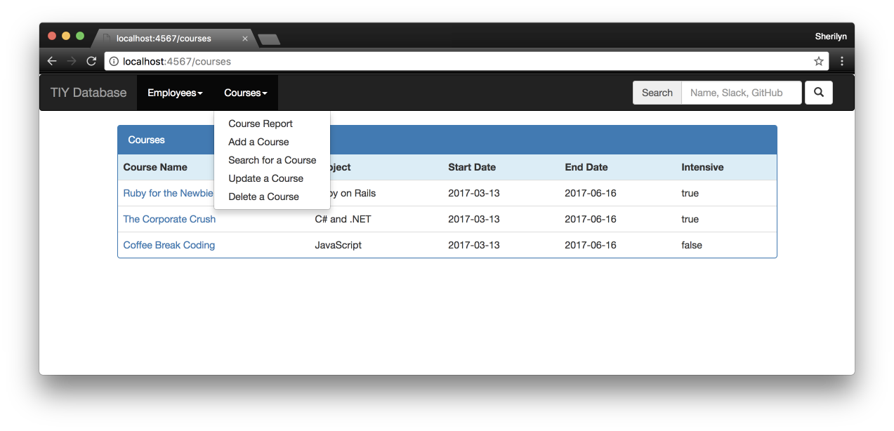

# TIY Database With Sinatra and ActiveRecord

### This is a continuation of the TIY Database converted to use Active Record

* To start this program you must have pstgresql and the sinatra gem installed    
  * createdb tiy-database
  * pgcli tiy-database
  * CREATE TABLE employees(id serial, name text, phone text, address text, position text, salary integer, github text, slack text)
  * run from the command line: ruby tiydatabase.rb
  * open your browser to http://localhost:4567/
* Validations added for:
  * name
  * salary
  * position must be either Instructor or Student
  * phone number to be in the correct format
* The user is notified about what validation failed
* Course information collected:
  * name
  * subject
  * start_date
  * end_date
  * intensive (boolean, true if intensive class, false otherwise)

